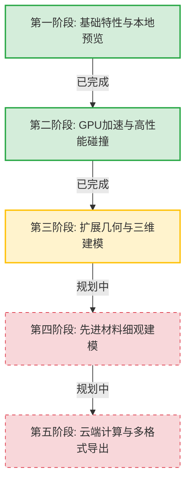

# RandomCAD 发展路线图 (Roadmap)

本文档概述了 RandomCAD (随机骨料颗粒生成器) 的历史进展、当前状态以及未来的长远发展规划。我们致力于将其打造为混凝土细观结构与采空区充填二维/三维细观建模领域最专业、最高效的开源工具。

---

## 🗺️ 阶段里程碑

---

## 🟢 第一阶段：基础特性与本地预览 (已完成)

专注于软件核心架构的搭建、双 CAD 平台的接入以及用户体验的优化。

- [x] **双 CAD 平台支持**：实现 AutoCAD（基于 pyautocad/comtypes）和中望CAD (ZWCAD) 的驱动接入，支持双向心跳检测与断线重连。
- [x] **UI 交互升级**：基于 PySide6 构建现代化、自适应的参数控制面板，将复杂参数归类展示。
- [x] **混合形状配比**：允许用户在单一粒径组中同时启用多边形、圆形、椭圆形骨料，并自由设定各自的随机生成权重。
- [x] **内置实时预览画布**：开发基于 `QGraphicsView` 的 2D 高速渲染画布，实现坐标轴（Y轴向上）与 CAD 的完全对齐，支持无需 CAD 连接时的“仅本地预览”模式。
- [x] **一键同步绘制**：支持在本地预览满意后，一键将骨料数据高速同步绘制到 CAD 图纸中。

---

## 🟢 第二阶段：GPU 加速与高性能碰撞 (已完成)

针对大规模骨料生成时的碰撞检测瓶颈进行数学与硬件层面的深层优化。

- [x] **空间索引优化**：集成了四叉树（Quadtree）和 KD 树（KD-Tree）空间索引算法，将碰撞检测的时间复杂度从 $O(N^2)$ 降低到 $O(N \log N)$。
- [x] **GPU 硬件加速**：基于 PyTorch CUDA (CUDA 12.1) 重构碰撞检测的距离计算矩阵，利用 GPU 的并行吞吐量加速高密度骨料计算。
- [x] **UI 状态智能联动**：在主界面新增 GPU 开关与状态栏监控，支持在运行期间动态锁定以避免冲突。
- [x] **性能基准工具**：编写 `benchmark_gpu.py` 基准测试脚本，量化 CPU 模式与 GPU 加速模式在不同规模下的性能交叉点 (Crossover Point)。

---

## 🟡 第三阶段：扩展几何与三维建模 (正在进行中)

从二维平面建模全面向三维实体建模迈进，满足更深层次的有限元数值模拟需求。

- [ ] **三维几何生成**：
  - [ ] 三维球体、三维椭球体骨料算法。
  - [ ] 随机三维多面体（通过 Voronoi 剖分或随机凸包算法生成）骨料。
- [ ] **三维碰撞检测与空间索引**：
  - [ ] 开发三维八叉树 (Octree) 空间划分结构。
  - [ ] 开发三维 KD 树空间索引。
  - [ ] 基于 PyTorch 3D 算子加速三维凸多面体碰撞干涉判定。
- [ ] **3D CAD 平台同步**：
  - [ ] 支持在 AutoCAD/中望CAD 中生成真正的 3D 实体模型（3D Solid）。
- [ ] **有限元网格前处理导出**：
  - [ ] 导出为 ANSYS (APDL)、ABAQUS (INP) 和 COMSOL 可直接导入的实体几何或有限元网格格式。
- [ ] **采矿充填边界自适应接入**：
  - [ ] 支持直接读取和解析巷道、采坑、采场等复杂不规则的三维 CAD 边界，自动识别充填腔体作为生成域。

---

## 🔴 第四阶段：先进材料细观建模 (未来规划)

引入更符合实际物理和工程规范的骨料级配生成数学模型。

- [ ] **规范级配曲线拟合**：
  - [ ] 支持 Fuller（富勒）级配曲线、Weymouth 级配曲线的内置算法。
  - [ ] 用户可以通过粒径通过率表格自定义导入级配曲线，软件自动计算各粒径组所需的理论体积分数/骨料数量。
- [ ] **超高体积分数密实算法 (High Volume Packing)**：
  - [ ] 引入重力沉降算法、随机游走动力学算法或蒙特卡洛松弛算法，使骨料能突破常规随机投放的极限，达到 70% 以上的体积分数。
- [ ] **充填体浆体自流堆积模拟 (Gob Backfill Slurry Packing)**：
  - [ ] 研发模拟高浓度充填浆体在重力和自流堆积下的下沉、沉降收缩和骨料分层分级级配分布判定算法。
- [ ] **精细化三相介质建模**：
  - [ ] 支持骨料（Aggregate）、界面过渡区（ITZ）以及水泥砂浆基体（Mortar Matrix）的三相精确几何分割，用于高精度的数值拉伸/压缩破损模拟。

---

## 🔴 第五阶段：云端计算与多格式导出 (长远规划)

打破本地计算资源限制，提供更加开放和跨平台的使用方式。

- [ ] **Web 网页端生成器**：
  - [ ] 基于 FastAPI + Three.js 开发纯网页端骨料生成和三维交互展示平台，免去本地环境配置与库安装的烦恼。
- [ ] **开放标准格式导出**：
  - [ ] 支持在线或本地导出为标准的 `.dxf` (CAD 二维/三维)、`.step` / `.iges` (通用 CAD 实体)、`.stl` / `.obj` (三维网格) 格式，全面适配工业级工作流。

---

*如果您对路线图中的功能有任何建议、需求，或者愿意参与到开发贡献中，请随时通过 Issue 或 Pull Request 与我们联系！*
